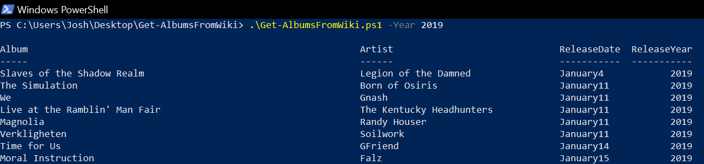

# Get-AlbumsFromWiki

## Description
A PowerShell webscraper that gets music albums from Wikipedia and formats it into a table.

## Installing the script
Please copy and paste the Get-AlbumsFromWiki.ps1 file found in this repository to your local machine.

## Usage

`.\Get-AlbumsFromWiki.ps1 -Year 2019`

Use the -ExportCache parameter to export the table to CSVs. This will create a folder where the script is running called "AlbumCache" and put all the CSVs in the folder. If you run the script again, you can use the -UseCache parameter and it will automatically reference the exported CSVs instead of making web requests and formatting the data again.

`.\Get-AlbumsFromWiki.ps1 -Year 2010,2011,2012 -ExportCache`

