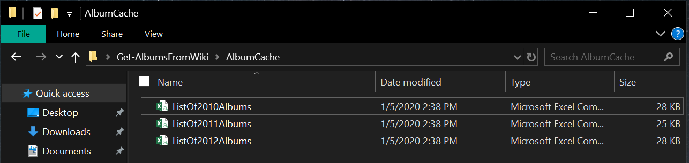

# Get-AlbumsFromWiki

## Description
A PowerShell webscraper that gets music albums from Wikipedia and formats it into a table.

## Installing the script
`Install-Script -Name Get-AlbumsFromWiki`

## Usage

`.\Get-AlbumsFromWiki.ps1 -Year 2019`

Use the `-ExportCache` parameter to export the table to CSVs. This will create a folder where the script is running called "AlbumCache" and put all the CSVs in the folder. If you run the script again, you can use the `-UseCache` parameter and it will automatically reference the exported CSVs instead of making web requests and formatting the data again.

`.\Get-AlbumsFromWiki.ps1 -Year 2010,2011,2012 -ExportCache`

Then run the script again using the `-UseCache`:

`.\Get-AlbumsFromWiki.ps1 -Year 2010,2011,2012 -UseCache`

The `-AllYears` parameter is also availble but will take long to run as it will invoke web requests from 1938 to the current year.

## List of possible parameters
 Parameter | Possible Values 
--- | --- |
-AllYears | [Switch]
-ExportCache | [Switch]
-UseCache | [Switch]
-Year | [Array]1938-The current year
